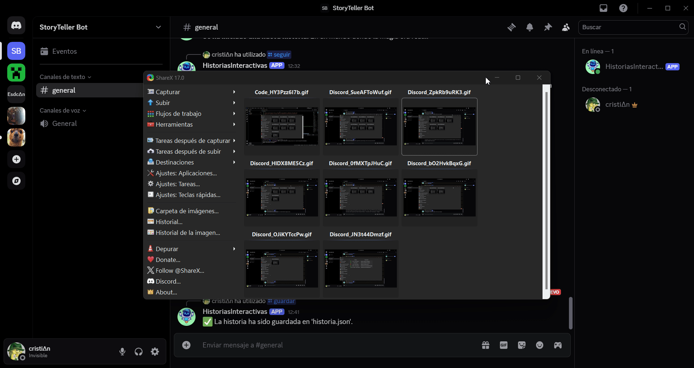

# Historias Interactivas (Storytelling Bot)

**HistoriasInteractivas**, also known as **Storytelling Bot**, is a program established on Discord whose main purpose is to entertain and provoke thought in the user. Unlike other Discord bots, which are designed to perform predefined functions -such as providing server information or guiding the user through the channel- HistoriasInteractivas uses AI (Artificial Intelligence) to engage in a 'conversation' with the user or to tell them a joke. Thanks to AI, it is possible to combine story fragments between the human and the bot, resulting in a rather interesting and intricate narrative.

> **Note**: HistoriasInteractivas is not finished. As of 02/05/2025, the program is still under development. For this reason, to learn more about the future of HistoriasInteractivas, I recommend taking a look at the `CONTRIBUTING.md` file, which contains several ideas about the future of this project.
Community contributions and feedback are welcome as the project evolves.

# Motivation

The spark that has driven me to create and improve this project over the course of several months lies in the cooperation between AI and humans. I find it fascinating that humans rely on AI for certain aspects, while AI depends entirely on humans to function. For this very reason, I decided to create a program that merges human thought with artificial intelligence data, so that neither is dependent on the other, and both can collaborate with a single purpose: a story.

As a side note, part of my motivation also came from a personal curiosity: to see whether I was capable of completing a demanding yet interesting project, and to challenge myself in the process.
What began as a simple experiment gradually turned into a passion project -one that helped me grow not only in technical skills, but also in creativity, perseverance, and problem-solving-.

# Getting started

To get started with HistoriasInteractivas, you must correctly follow these steps:

- Create a local folder and clone this repository into it using the GitBash command `git clone yourSSHkey`, where yourSSHkey can be found under the CODE section of this repository.
- Inside that folder, you must create a file named .env, which must contain the following (the details will be explained further below):
```
OPENROUTER_API_KEY='your OpenRouter API KEY'
DISCORD_BOT_TOKEN='your Discord bot TOKEN'
```
- For the **DISCORD_BOT_TOKEN**, the user must register their own bot through the [Discord Developer Portal](https://discord.com/developers/applications). Create an application, open it, and go to the OAuth2 tab. In the OAuth2 URL Generator, check the boxes for Bot and Applications.commands.
Scroll down and select the required permissions for the bot:
  - `Send Messages`
  - `Read Message History`
  - `Use Slash Commands`
- At the bottom, a URL will be generated to invite the bot to any Discord server of your choice.
Additionally, go to the Bot tab in the left-hand menu and click Reset Token to generate your bot's token. Copy this token and paste it into the .env file, replacing `your Discord bot TOKEN`.
- For the **OPENROUTER_API_KEY**, go to [OpenRouter](https://openrouter.ai/) in your browser and search for Google: Gemini Flash 1.5. Once selected, go to the API tab and click Create API Key. After the key is generated, copy and paste it into your .env file where it says `your OpenRouter API KEY`.
- Once all of the above is completed, you're ready to run the .py file.
From my experience, Python version 3.13 does not work with this program, so I recommend installing Python 3.11, which does work correctly.
To run the bot, simply use the command:
```
py -3.11 bot.py
```

### As a final recap, here's everything you need to get the program up and running: ###
- Git installed
  - Used to clone the repository from GitHub.
  - [Git](https://git-scm.com/downloads)
- Python 3.11 installed
  - Python 3.13 is currently not compatible with the project, other versions were not tested.
  - [Python 3.11](https://www.python.org/downloads/release/python-3110/)
- GitHub account
  - To clone the repository.
- Discord account
  - Needed to access the Discord Developer Portal and create your own bot.
- Registered Discord bot
  - You will need its token to run the program.
- OpenRouter account
  - Required to generate an API key to use with the Gemini AI model.
- .env file in your project directory
  - Contains your **DISCORD_BOT_TOKEN** and **OPENROUTER_API_KEY**.
- Text/code editor (optional but recommended)
  - For editing files easily (VSCode, PyCharm, IntelliJIDEA, etc.)

HistoriasInteractivas will then be active on your Discord server and ready to respond to commands.

# Commands

To use the bot's features, you must type the different commands with a forward slash / at the beginning. The available commands are:

> Since I'm from Spain, HistoriasInteractivas may respond your commands in Spanish.

- `/hola`: The bot will greet the user.

- `/ia`: The bot will respond using AI to a question you type (Discord allows a maximum of 2000 characters per message, so the response might be incomplete).

- `/inicia`: Starts a story using AI.

- `/nueva`: Restarts the story, this time with a randomly selected default beginning from a preset list.

- `/seguir`: The bot will prompt you to write something. The AI will take your input and continue the story accordingly (Discord allows a maximum of 2000 characters per message, so the response might be incomplete).

- `/finalizar`: The bot will ask you to input the ending of the story.

- `/guardar`: Saves the story to a JSON file so you can view it in full later.

- `/chiste`: The AI will tell you a joke based on the topic you request.

